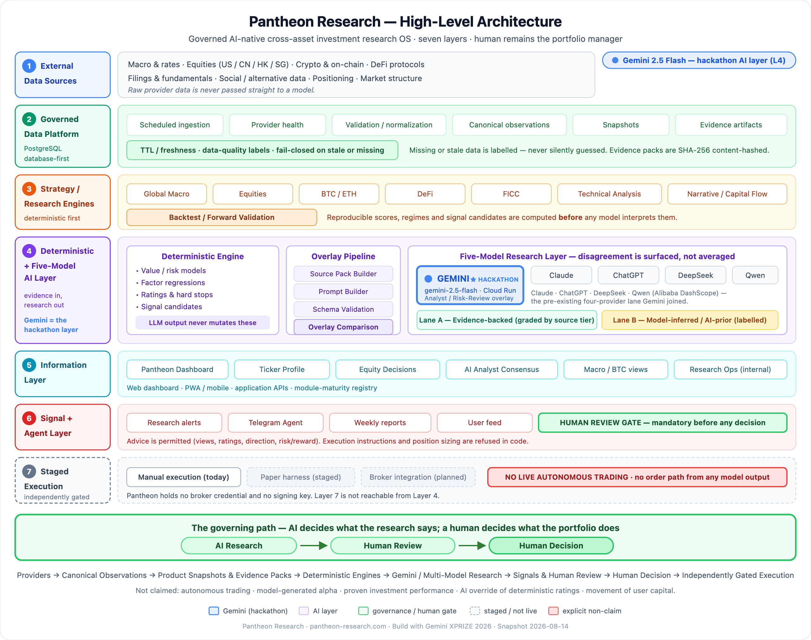
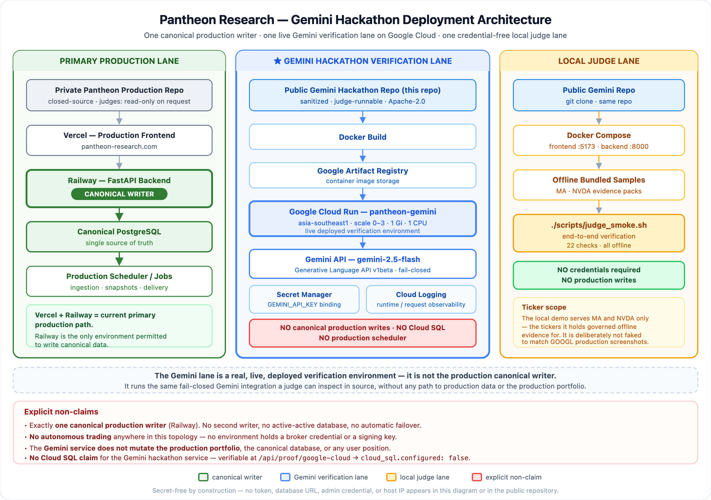

<div align="center">

# Pantheon Research

### Governed AI-Native Cross-Asset Investment Research OS

**Transforming governed market evidence into explainable research, signals,<br/>model comparison, validation, and human-reviewed decisions.**

> ### AI should not replace the investor.<br/>AI should compound the investor's discipline.

```text
Wrong Strategy × AI = Faster Loss
Right Strategy × AI = Compounded Discipline
```

[](https://github.com/0xjacobzhao-byte/pantheon-research-gemini-hackathon/actions/workflows/ci.yml)
[](LICENSE)
[](https://pantheon-research.com)
[](https://pantheon-gemini-549837878368.asia-southeast1.run.app/api/proof/gemini)
[](https://pantheon-gemini-549837878368.asia-southeast1.run.app/api/proof/google-cloud)
[](#safety--non-claims)

**[Live Product](https://pantheon-research.com)** ·
**[Devpost](https://devpost.com/software/pantheon-research-qzn50k)** ·
**[Gemini Cloud Run](https://pantheon-gemini-549837878368.asia-southeast1.run.app/health)** ·
**[Gemini Proof](https://pantheon-gemini-549837878368.asia-southeast1.run.app/api/proof/gemini)** ·
**[Circle Proof](https://basescan.org/tx/0x699bbb9ddb03f9a98525749374fb976a9cd7ef6319414d1cb5e422d810eac6e3)** ·
**[Architecture](#architecture)** ·
**[Evidence Index](docs/PRODUCT_EVIDENCE_INDEX.md)**

</div>

---

## Judge Quick Path

Steps 1–4 need nothing but a browser.

| # | Step | Where |
|---|---|---|
| 1 | **Open the live product** | [pantheon-research.com](https://pantheon-research.com) |
| 2 | **See the seven-layer architecture** | [§ Architecture](#architecture) |
| 3 | **Inspect the Gemini analyst workflow** | [§ Gemini](#gemini--the-hackathon-ai-layer) · [`gemini_overlay.py`](backend/app/gemini_overlay.py) |
| 4 | **Verify the live Gemini / Google Cloud proof** | [`/api/proof/google-cloud`](https://pantheon-gemini-549837878368.asia-southeast1.run.app/api/proof/google-cloud) · [`/api/proof/gemini`](https://pantheon-gemini-549837878368.asia-southeast1.run.app/api/proof/gemini) |
| 5 | **Read representative production code** | [`production_reference/`](production_reference/) |
| 6 | **Verify the Circle transaction** | [BaseScan](https://basescan.org/tx/0x699bbb9ddb03f9a98525749374fb976a9cd7ef6319414d1cb5e422d810eac6e3) — read the *ERC-20 Tokens Transferred* row ([why](#circle-agentic-economy)) |
| 7 | **Review the evidence index** | [`docs/PRODUCT_EVIDENCE_INDEX.md`](docs/PRODUCT_EVIDENCE_INDEX.md) |
| 8 | **Run the local demo** *(optional)* | [§ Run Locally](#run-locally) — no API keys required |

**Scope boundary:** Pantheon predates this hackathon and says so —
[`docs/SUBMISSION_SCOPE.md`](docs/SUBMISSION_SCOPE.md).

---

## What Pantheon Research Is

A **cross-asset research operating system** for investors, analysts, and
allocators who need disciplined, explainable decision support across macro,
equities, digital assets, and FICC — instead of a dozen disconnected tools
stitched together by hand.

The problem is not a lack of financial information. **The problem is the absence
of structured, governed, and explainable decision intelligence.** Raw data is
not a view, and a raw model opinion is not research. Pantheon sits between them.

|  | Pantheon is **not** | Pantheon **is** |
|---|---|---|
| Interface | a finance chatbot | a governed research operating system |
| Output | a raw-model opinion feed | evidence-graded research with provenance |
| Structure | a collection of dashboards | seven integrated layers |
| Execution | an automatic signal-to-order bot | research that stops at a human review gate |

**The thesis:** framework first · data governed · deterministic before
probabilistic · signal is not a trade · human remains portfolio manager.

---

## Architecture

<p align="center">
  
</p>

<div align="center"><sub><b>Seven layers.</b> Deterministic engines compute scores <i>before</i> any model interprets them. AI research reaches a human review gate — <b>layer 7 is not reachable from layer 4</b>, and no code path leads from a model output to an order.</sub></div>

<br/>

```text
Providers → Canonical Observations → Product Snapshots & Evidence Packs
         → Deterministic Research Engines → Gemini / Multi-Model Research
         → Signals & Human Review → Human Decision → Independently Gated Execution
```

<details>
<summary><b>The seven layers in detail</b></summary>

<br/>

| # | Layer | Role |
|---|---|---|
| 1 | **External Data Sources** | Macro/rates, equities, crypto/DeFi, social/alt data, positioning, market structure |
| 2 | **Governed Data Platform** | Ingestion scheduling, provider health, validation/normalization, canonical observations, snapshots, evidence artifacts, TTL/freshness, data-quality labelling |
| 3 | **Strategy / Research Engines** | Macro, Equity (US/CN/HK/SG), BTC/ETH, DeFi, FICC, Technical Analysis, Narrative, Backtest/Validation |
| 4 | **Deterministic + Five-Model AI** | Deterministic models and ratings, plus a five-model overlay (Source Pack → Prompt → Schema Validation → Overlay Comparison) |
| 5 | **Information Layer** | Dashboard, Ticker Profile, Equity Decisions, AI Analyst Consensus, Research Ops |
| 6 | **Signal + Agent Layer** | Research alerts, Telegram agent, weekly reports — behind a human-review gate |
| 7 | **Staged Execution Boundary** | Manual today; independently gated; no live autonomous trading |

Layer-by-layer method and invalidation rules:
[`docs/strategy_stack.md`](docs/strategy_stack.md).

</details>

---

## What Was Built During This Hackathon

**Pantheon Research existed before this hackathon.** Full boundary, with every
row anchored to a commit, transaction, or live endpoint:
[`docs/SUBMISSION_SCOPE.md`](docs/SUBMISSION_SCOPE.md).

| | |
|---|---|
| **Pre-existing** | Product, brand, live site, private production repo, governed data platform, deterministic research engines, and a **four-provider** LLM lane (Claude · ChatGPT · DeepSeek · Qwen) |
| **Built for this submission** | **Gemini Analyst / Risk-Review layer** · **Google Cloud deployment** (Cloud Run, Artifact Registry, Secret Manager, Cloud Logging, live proof endpoints, verified live `gemini-2.5-flash` call) · **this judge-facing repository** · **Circle Agent Wallet on-chain payment proof** · **submission evidence package** |

Gemini joined a pre-existing four-provider lane, making the stack five-model.
Stated plainly so the contribution is weighted correctly.

---

## Gemini — the Hackathon AI Layer

Gemini is the **AI layer built during this submission period**, integrated into
the pre-existing multi-provider lane and deployed independently on Google Cloud.

```text
Governed Evidence Pack → Gemini → Structured Analyst / Risk Overlay
                       → Multi-Model Comparison → Human Review
```

| Property | Value |
|---|---|
| Model | **`gemini-2.5-flash`** (Generative Language API v1beta) |
| Runtime | **Google Cloud Run** — `asia-southeast1`, scale 0–3, 1 Gi, 1 CPU |
| Image | **Google Artifact Registry** |
| Secrets | **Google Secret Manager** — `GEMINI_API_KEY` bound via `--set-secrets` |
| Logging | **Google Cloud Logging** |
| Local default | **Offline** — bundled samples, no API key required |

### Fail-closed by design

| Condition | Status | Behavior |
|---|---|---|
| No API key | `BLOCKED_BY_MISSING_CREDENTIAL` | No call made, no fake result |
| API error | `API_ERROR` | Retry with backoff, then report |
| Non-JSON response | `PARSE_ERROR` | Report immediately, no retry |
| Offline mode | `OFFLINE_SAMPLE` | Bundled samples from `data/gemini_samples/` |

**Gemini never returns a fake SUCCESS.** Every failure mode maps to an explicit,
distinct, tested status.

> **On the offline samples.** The two bundled fixtures in `data/gemini_samples/`
> record the model that *actually produced them* — `gemini-2.0-flash` — and carry
> a `model_note` saying so. The live path (local live mode and Cloud Run) uses
> **`gemini-2.5-flash`**, confirmed by
> [`/api/proof/gemini`](https://pantheon-gemini-549837878368.asia-southeast1.run.app/api/proof/gemini)
> and by the captured live call in
> [`data/gemini_live_call_redacted.json`](data/gemini_live_call_redacted.json).
> A historical capture is provenance; relabelling it to match current docs would
> have made the repo consistent by making it untrue.

```bash
curl -s https://pantheon-gemini-549837878368.asia-southeast1.run.app/api/proof/gemini | jq
curl -s https://pantheon-gemini-549837878368.asia-southeast1.run.app/api/proof/google-cloud | jq
curl -s https://pantheon-gemini-549837878368.asia-southeast1.run.app/api/overlay/gemini/NVDA | jq
```

Implementation: [`backend/app/gemini_overlay.py`](backend/app/gemini_overlay.py) ·
Evidence: [`docs/gemini_production_evidence.md`](docs/gemini_production_evidence.md)

---

## Deployment Architecture

<p align="center">
  
</p>

<div align="center"><sub><b>Three lanes, one canonical writer.</b> Vercel + Railway is the primary production path; Railway alone may write canonical data. The Gemini lane is a real, live, deployed verification environment — <b>not</b> the production writer.</sub></div>

<br/>

| Environment | Role | Writes |
|---|---|---|
| **Vercel** | Production frontend (`pantheon-research.com`) | — |
| **Railway** | Production backend — **canonical writer** | **Enabled** |
| **GCP Cloud Run** | **Gemini verification lane** | Fail-closed OFF |
| **Local Docker Compose** | Offline judge demo | None — no credentials |

**Not claimed:** a second production writer · active-active replication ·
automatic failover · a full production database clone · **Cloud SQL for the
Gemini service** (verifiable at
[`/api/proof/google-cloud`](https://pantheon-gemini-549837878368.asia-southeast1.run.app/api/proof/google-cloud)
→ `cloud_sql.configured: false`).

Full Google Cloud evidence:
[`docs/gemini_production_evidence.md`](docs/gemini_production_evidence.md).

---

## What AI Actually Does

Pantheon uses AI for **research-operation decisions** — not capital decisions:

**evidence synthesis** · **factor classification** · **risk identification** ·
**evidence-gap detection** · **model disagreement detection** ·
**confidence assessment** · **verification-task generation** ·
**human-review escalation** · **research summarization** ·
**agent routing / tool selection** · **personalized research explanation**

And then, explicitly:

```text
AI research decisions  ≠  capital-allocation / trading decisions
```

**AI decides what the research says. A human decides what the portfolio does.**

The boundary is enforced in code, not policy prose. Pantheon's agent layer
*permits* investment advice — views, ratings, direction, risk/reward — and
*refuses* execution: order-lifecycle instructions, leverage instructions,
personalized position sizing, and any claim to have transmitted an instruction
to a venue. Pantheon holds no order path, no broker credential, and no signing
key.

**Read the actual rule:**
[`production_reference/advice_policy.py`](production_reference/advice_policy.py).

---

## Deterministic Research + Five-Model AI

**Deterministic engines own** scores, regimes, valuations, hard stops, signal
candidates, reproducibility. **AI modules own** qualitative interpretation,
contradiction detection, model comparison, evidence-gap discovery, risk
explanation, verification-task generation.

| Provider | Role | Boundary |
|---|---|---|
| **Gemini** ★ | Analyst / risk-review overlay — **the hackathon layer** (Google Cloud) | Reads governed evidence; never trades |
| Claude | Qualitative overlay & risk reasoning | Reads governed evidence; never trades |
| ChatGPT | Qualitative overlay & comparison | Reads governed evidence; never trades |
| DeepSeek | Qualitative overlay (production lane) | Reads governed evidence; never trades |
| Qwen | Qualitative overlay (Alibaba DashScope) | Reads governed evidence; never trades |

**Two lanes, never blurred.** *Evidence-backed* output is graded by an evidence
tier computed from source-pack provenance; *model-inferred / AI-prior* output is
explicitly labelled. An AI prior can **never** present as source-backed — the
tier is computed from source metadata only, so the model that produced a payload
never grades it.

**Disagreement is surfaced, not averaged away.** Where providers disagree, that
becomes a human-review trigger rather than a number to smooth over. A provider
that failed or was skipped stays *visible* — a silently absent provider reads as
agreement.

<details>
<summary><b>Why this is not an LLM wrapper</b></summary>

<br/>

| Capability | Implementation |
|---|---|
| Evidence provenance | Source packs bound to SHA-256 content hashes |
| Fail-closed states | Missing, stale, blocked, parse and provider failures stay visible — never a hollow success |
| Schema validation | Structured model output validated before serving |
| Multi-model comparison | Provider-level agreement and divergence, not a single opinion |
| Evidence hierarchy | Source-backed kept structurally separate from AI-prior |
| Human review | Disagreements and missing evidence generate review tasks |
| Research Ops | Coverage, provider health, queues, audit trail |
| Signal separation | AI research has no execution path |

Each row is backed by real production source in
[`production_reference/`](production_reference/) — five stdlib-only files that
open no network connection, read no credential, and touch no database.

</details>

---

## Current Maturity

Status vocabulary: `LIVE` (in production) · `BETA` (controlled rollout) ·
`INTERNAL` (operator-gated, never public) · `PROOF` (verified deployment or
transaction, not a production writer) · `PUBLIC DEMO` (runnable in this repo) ·
`STAGED` (built, fail-closed, not enabled).

| Capability | Production status | Public evidence | Judge verification |
|---|---|---|---|
| Cross-asset dashboard | `LIVE` | Live product | [pantheon-research.com](https://pantheon-research.com) |
| Ticker Profile / Equity Decisions | `LIVE` | Live product | Live product (GOOGL) |
| **Gemini Analyst layer** | `PROOF` (live deployed) | Cloud Run + proof endpoints | [`/api/proof/gemini`](https://pantheon-gemini-549837878368.asia-southeast1.run.app/api/proof/gemini) |
| Five-model comparison | `LIVE` (cache-only) | Comparison contract | [`overlayComparison.ts`](production_reference/overlayComparison.ts) · `PUBLIC DEMO` |
| Macro framework | `LIVE` | Live product | `/api/modules` (local) |
| BTC framework | `LIVE` | Live product | `/api/modules` (local) |
| Data governance (TTL / quality) | `LIVE` | Freshness registry | [`freshness_policy.py`](production_reference/freshness_policy.py) |
| Research Ops | `INTERNAL` | Governance slice | `/api/data-quality` (local) |
| Signal delivery | `INTERNAL` (dry-run default) | Documented | — |
| Telegram Agent | `BETA` (controlled) | Advice/execution boundary | [`advice_policy.py`](production_reference/advice_policy.py) |
| Weekly automated reports | `BETA` (controlled) | Documented | — |
| Circle Agent Wallet payment | `PROOF` (one mainnet tx) | On-chain, independently verifiable | [BaseScan](https://basescan.org/tx/0x699bbb9ddb03f9a98525749374fb976a9cd7ef6319414d1cb5e422d810eac6e3) |
| Forward validation | `LIVE` (maturity varies) | Methodology | [`validation_methodology.md`](docs/validation_methodology.md) |
| Trading / execution | `STAGED` · fail-closed | Non-claims | No order path exists |

Maturity is reported as it is. Nothing is upgraded to make this table look
better; `INTERNAL` is never publicly available and `PROOF` is never production.

---

## Research Stack

| Domain | Primary output | Status |
|---|---|---|
| Global Macro | Regime classification, exposure context | `LIVE` |
| US / CN / HK / SG Equities | Company research, valuation, model comparison | `LIVE` |
| Bitcoin · Ethereum | Cycle / valuation stance with kill switches | `LIVE` |
| DeFi | Yield / risk verdicts | `LIVE` |
| Fixed Income · FX · Commodities | Cross-asset allocation and carry views | `LIVE` |
| Technical Analysis · Narrative | Multi-asset scans, thematic context | `LIVE` |
| Backtest / Forward Validation | Point-in-time validation infrastructure | `LIVE` |

Investment logic is defined by **versioned frameworks, not improvised prompts**.
Method, primary output, and the invalidation rule for each domain:
[`docs/strategy_stack.md`](docs/strategy_stack.md). Proprietary formulas,
thresholds and weights remain private.

---

## Governed Data Platform

Pantheon is database-first: research reads governed, point-in-time observations,
not ad-hoc API calls at request time.

```text
Providers → Ingestion + Provider Routing → Validation + Normalization
          → Canonical Observations → Derived & Product Snapshots
          → Evidence Artifacts → Research Engines → Dashboard / Alerts / APIs
```

Every observation carries provenance, freshness, quality, and provider state.
**Missing or stale data is labelled, never silently guessed** — each module
declares how fresh its data is *supposed* to be, and actual age is measured
against that declaration rather than a global default. `SOFT_STALE` is still
served but labelled, and the label reaches the user; `HARD_STALE` has failed its
own freshness contract.

**Read the real registry:**
[`production_reference/freshness_policy.py`](production_reference/freshness_policy.py).

---

## Validation

Pantheon distinguishes four things that are routinely conflated:

| Term | What it means here |
|---|---|
| **Historical backtest** | A strategy run over stored history. Cheapest, weakest evidence. |
| **Reconstructed history** | History rebuilt from current-cohort data — carries **declared survivorship limitations**. |
| **Point-in-time evidence** | Data as it was observable at decision time, with vintage discipline. |
| **Forward validation** | Signals captured prospectively, before outcomes exist. |
| **Matured outcomes** | Forward signals whose evaluation window has actually closed. |

**Only matured forward outcomes support a performance claim.** Pantheon captures
signals prospectively and lets them mature rather than marketing immature
evidence as proven alpha. Where a framework has been falsified in internal
research, it is retired rather than retuned.

**No validated-alpha claim is made anywhere in this submission.**

---

## Circle Agentic Economy

A bounded **Circle Agent Wallet** on-chain payment proof — founder-funded,
operator-mediated, policy-limited, independently verified on Base mainnet.

| | |
|---|---|
| Agent wallet | `0xaae4fab28919e5d0275fed67fca2100e0eb454bc` |
| Chain / token | Base mainnet (`8453`) · USDC |
| Amount | **0.100000 USDC** · block `49907662` · receipt `0x1` |
| Transaction | [`0x699bbb9d…eac6e3`](https://basescan.org/tx/0x699bbb9ddb03f9a98525749374fb976a9cd7ef6319414d1cb5e422d810eac6e3) |
| Circle policy caps | per-tx 1 · daily 2 · weekly 5 · monthly 10 USDC |

> **Verifying:** the wallet is an **ERC-4337 smart account**, so the outer
> transaction's `from` is a bundler and its `to` is the EntryPoint contract.
> Read the **"ERC-20 Tokens Transferred"** row on BaseScan, not the top-level
> From/To. Gas was sponsored by Circle — the wallet held 0 ETH before and after.

**Limitations, stated plainly.** The payment was **operator-mediated** and does
**not** demonstrate an autonomous or recurring treasury. It involved **no user
capital**, **no trading**, and **no Pro entitlement**. Pantheon's production
Agent Treasury exists separately in the private system, but **this proof did not
complete the production signed-in approval flow**, and the Pantheon cloud proof
verifier did not execute or verify it. **No recipient allowlist was
machine-enforced** — the recipient is operator-attested, with risk bounded
instead by funding the wallet with exactly the proof amount.

Payment is **not an agent-invocable tool**, so prompt injection has no path to
money. Full detail:
[`docs/circle_agentic_economy_evidence.md`](docs/circle_agentic_economy_evidence.md).

---

## Business Model

Free research → **Pantheon Pro** → Research Credits → premium research /
playbooks → skills marketplace → advanced data / API → B2B / enterprise
licensing.

Only free research is live; Pro is a controlled beta with billing gated off.

### Actual hackathon-period results

| Metric | Actual |
|---|---:|
| Revenue | **$0.00** |
| Total expenses | **$926.12** |
| Net result | **−$926.12** |
| Verified external users | **0** |
| Paying users | **0** |

**No traction is claimed.** Full cash-basis P&L, with projections quarantined
below an explicit warning:
[`docs/business_model_and_pnl.md`](docs/business_model_and_pnl.md).

---

## Safety / Non-Claims

Pantheon Research is a research and decision-support system, **not financial
advice**. This submission explicitly does **not** claim:

- ❌ **No autonomous trading** — execution is manual and independently gated
- ❌ **No model-generated alpha** — LLMs produce research overlays, not edge
- ❌ **No proven investment performance** — no validated-alpha claim
- ❌ **No user-capital movement** — Pantheon never moves user funds
- ❌ **No Gemini-controlled trading** — Gemini reads evidence, writes research
- ❌ **No Circle-controlled trading** — the payment rail is structurally separate from any order path
- ❌ **No AI override of deterministic ratings** — LLM output never mutates a deterministic score

**AI produces research intelligence. Humans remain responsible for investment
decisions.**

---

## Repository Scope

| | Public Gemini repo (this) | Private production repo |
|---|---|---|
| **Purpose** | Judge-runnable, sanitized verification slice | Complete production source of truth |
| **Gemini integration** | ✅ Full fail-closed implementation | ✅ Same integration, production-wired |
| **Model comparison** | ✅ Contract + demo (3 providers offline) | ✅ Five providers, live, DB-persisted |
| **Data** | Bundled sample evidence packs | Governed canonical PostgreSQL |
| **Universe** | MA · NVDA | Full multi-market research universe |
| **Strategy engines** | ❌ Method described, formulas withheld | ✅ Complete, versioned |
| **Production database** | ❌ None required | ✅ Canonical, single source of truth |
| **Research Ops** | Read-only public-safe slice | ✅ Full operator control plane |
| **Trading** | ❌ No order path | `STAGED`, fail-closed, no live trading |
| **Secrets** | ❌ None — `.env.example` is empty | Managed outside the repository |
| **Judge reproducibility** | ✅ `docker compose up` — no credentials | Access on request |

The private repository remains closed to protect proprietary strategy IP,
provider integrations, operational runbooks, and production data infrastructure.
**Judges may request temporary read-only access** if competition rules allow.

Everything in [`production_reference/`](production_reference/) is a **deliberate
public release decision** under Apache-2.0, reviewed for secrets, customer data,
operational topology and strategy IP before publication — see
[`docs/security_and_sanitization.md`](docs/security_and_sanitization.md).

---

## Run Locally

The full judge demo runs **with no API keys**.

```bash
git clone https://github.com/0xjacobzhao-byte/pantheon-research-gemini-hackathon
cd pantheon-research-gemini-hackathon
docker compose up --build          # frontend :5173 · backend :8000
./scripts/judge_smoke.sh           # 22 checks, offline, no secrets
```

```bash
curl -s http://localhost:8000/api/proof/gemini | jq
curl -s http://localhost:8000/api/overlay/gemini/NVDA | jq
```

> **Ticker scope.** The local demo ships governed evidence packs for **MA** and
> **NVDA** only. Production screenshots and the live product use **GOOGL** and a
> far broader universe. The demo is deliberately **not** faked to match those
> screenshots — for GOOGL, use the live product.

<details>
<summary><b>Manual setup, endpoints, and tests</b></summary>

<br/>

**Backend** (Python 3.11–3.12):
```bash
cd backend && python -m venv .venv && source .venv/bin/activate
pip install -r requirements.txt
uvicorn main:app --reload --port 8000
```

**Frontend** (Node.js 18+):
```bash
cd frontend && npm install && npm run dev
```

| Method | Path | Description |
|---|---|---|
| GET | `/health` | Health check |
| GET | `/api/overlay/gemini/{ticker}` | Gemini qualitative overlay |
| GET | `/api/proof/gemini` | Gemini proof (secret-free, no external calls) |
| GET | `/api/proof/google-cloud` | Google Cloud deployment proof (secret-free) |
| GET | `/api/proof/gcp` | GCP Cloud Run metadata proof |
| GET | `/api/evidence/{ticker}` | Evidence pack + SHA-256 provenance |
| GET | `/api/overlay/qwen/{ticker}` | Qwen overlay (comparison) |
| GET | `/api/overlay/deepseek/{ticker}` | DeepSeek overlay (comparison) |
| GET | `/api/comparison/{ticker}` | Multi-provider comparison |
| GET | `/api/qwen-config` | Qwen / DashScope model config (secret-free) |
| GET | `/api/data-quality` | Research-Ops governance snapshot |
| GET | `/api/modules` | Module snapshot grid |
| GET | `/api/provider-health` | Provider health |

**Tests**
```bash
cd backend && python -m pytest            # 97 tests
cd frontend && npm test -- --run          # 11 tests
cd frontend && npm run build              # production build
```

</details>

---

## Tech Stack

**Backend** FastAPI · Python 3.11–3.12 — **Frontend** React 18 · TypeScript ·
Vite 6 — **AI** Gemini 2.5 Flash (Google) · Claude · ChatGPT · DeepSeek · Qwen
(Alibaba DashScope) — **Database** PostgreSQL (production only) — **Payments**
Circle Agent Wallets (Base, USDC) — **Deploy** Vercel · Railway · Google Cloud
Run · Docker Compose — **Tests** pytest · vitest

---

## Documentation

| Document | What it covers |
|---|---|
| [`SUBMISSION_SCOPE.md`](docs/SUBMISSION_SCOPE.md) | Pre-existing vs hackathon-period work, evidenced |
| [`PRODUCT_EVIDENCE_INDEX.md`](docs/PRODUCT_EVIDENCE_INDEX.md) | Canonical claim → evidence map |
| [`strategy_stack.md`](docs/strategy_stack.md) | Frameworks, not prompts — method per domain |
| [`gemini_production_evidence.md`](docs/gemini_production_evidence.md) | Gemini / Google Cloud verification |
| [`circle_agentic_economy_evidence.md`](docs/circle_agentic_economy_evidence.md) | Circle proof and its limitations |
| [`business_model_and_pnl.md`](docs/business_model_and_pnl.md) | Actual P&L vs projections |
| [`security_and_sanitization.md`](docs/security_and_sanitization.md) | What is public, what stays private, and why |
| [`validation_methodology.md`](docs/validation_methodology.md) | Backtest vs forward validation discipline |
| [`judge_walkthrough.md`](docs/judge_walkthrough.md) | Ten-minute reviewer path |
| [`production_reference/`](production_reference/) | Five sanitized production source files |

---

<div align="center">

**Jacob Zhao** · [0xjacobzhao-byte](https://github.com/0xjacobzhao-byte) · Singapore
· **License:** [Apache-2.0](LICENSE)

<sub>No API keys, private user data, live trading credentials, production secrets, or private financial records are included in this repository.</sub>

<br/>

**Build the framework first. Let AI compound the discipline.**

</div>
